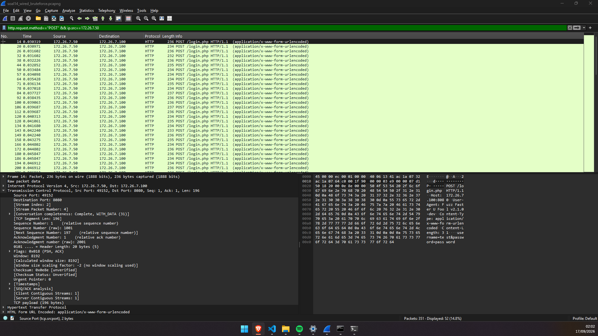
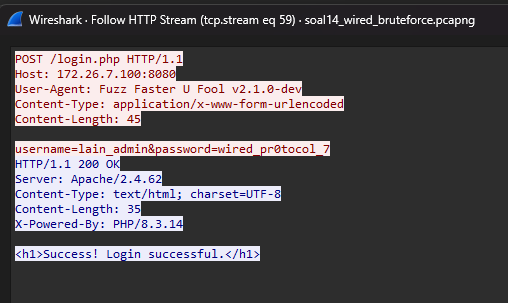
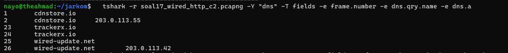
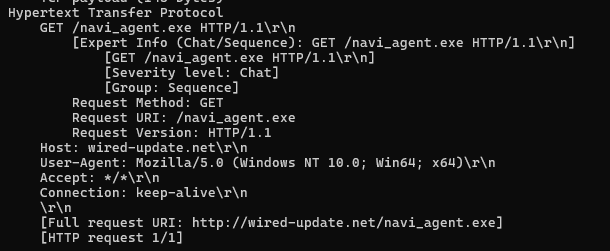
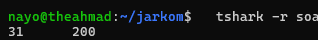

# Jarkom-Modul-1-2026-K-29
### Ahmad Nayottama Juliansyah - 5027251045 <br> Muhammad Nasrulhaq - 5027251117
---
```
Batas antara Dunia Nyata dan The Wired perlahan mulai runtuh setelah kepergian Chisa Yomoda, yang meninggalkan pesan bahwa dirinya tetap hidup di dalam The Wired. Di balik kekacauan ini berdiri Masami Eiri, mantan perancang Protokol 7 di Laboratorium Tachibana, yang setelah kematian fisiknya berhasil mengunggah kesadarannya ke jaringan dan mendeklarasikan diri sebagai penguasa The Wired, didukung kelompok peretas Knights of the Eastern Calculus.
Di tengah kekacauan ini, Lain Iwakura menyadari eksistensi sejatinya sebagai entitas pengendali The Wired. Untuk menjaga stabilitas komunikasi serta melindungi sahabatnya Alice Mizuki dan kakaknya Mika Iwakura dari campur tangan Eiri, Lain bertindak sebagai Router untuk membangun sendiri arsitektur jaringan The Wired yang aman.
```
#### 1. Untuk mempersiapkan pembangunan The Wired, Lain yang berperan sebagai Router membuat tiga Switch/Gateway: Switch 1 menuju dua Entitas yaitu Alice dan Mika, Switch 2 menuju Chisa, sedangkan Switch 3 menuju Knights dan Eiri. Kelima Entitas tersebut dikonfigurasi sebagai Client di GNS3.


---

#### 2. Karena menurut Lain pada saat itu The Wired masih terisolasi dari dunia luar, konfigurasikan router Lain agar dapat tersambung langsung ke jaringan internet publik melalui NAT/DHCP pada interface eth0.
Konfigurasi router agar tersambung langsung ke jaringan internet publik:
```
# Jalur Internet (menuju NAT1)
auto eth0
iface eth0 inet dhcp
    up sysctl -w net.ipv4.ip_forward=1
    up iptables -t nat -A POSTROUTING -o eth0 -j MASQUERADE
```

```
# Jalur ke Subnet-1 (Alice & Mika)
auto eth1
iface eth1 inet static
    address 10.78.1.1
    netmask 255.255.255.0
```
```
# Jalur ke Subnet-2 (Chisa)
auto eth2
iface eth2 inet static
    address 10.78.2.1
    netmask 255.255.255.0
```
```
# Jalur ke Subnet-3 (Knights & Eiri)
auto eth3
iface eth3 inet static
    address 10.78.3.1
    netmask 255.255.255.0
```
---

#### 3. Setelah router Lain terhubung ke internet, pastikan seluruh Entitas (Client) di bawah Switch 1, Switch 2, dan Switch 3 dapat saling terhubung dan berkomunikasi satu sama lain melalui konfigurasi routing.
Dengan configure router:
```
eth1 (Subnet Alice & Mika): 10.78.1.1
eth2 (Subnet Chisa): 10.78.2.1
eth3 (Subnet Knights & Eiri): 10.78.3.1
```
```
IP Alice: 10.78.1.2, Gateway 10.78.1.1
IP Mika:  10.78.1.3, Gateway 10.78.1.1
IP Chisa: 10.78.2.2 Gateway 10.78.2.1
IP Knights: 10.78.3.2 Gateway 10.78.3.1
IP Eiri: 10.78.3.3 Gateway 10.78.3.1
```
Jalankan perintah: ``` ping -c 2 10.78.x.x ``` untuk mengecek apakah client satu sama ain sudah dapat terhubung. 

Berikut melalui client1 (Alice) dengan menjalankan perintah: ``` ping -c 2 10.78.3.2 ``` (Knights) 


#### 4. Lain ingin agar setiap Entitas (Client) memiliki kemandirian di The Wired. Konfigurasikan firewall/iptables (NAT Masquerade) dan DNS resolver agar setiap Client dapat terhubung ke internet secara mandiri (dapat melakukan ping ke 8.8.8.8 dan membuka domain web google.com).
```
sysctl -w net.ipv4.ip_forward=1
```
```
iptables -t nat -A POSTROUTING -o eth0 -j MASQUERADE
iptables -A FORWARD -i eth1 -o eth0 -j ACCEPT
iptables -A FORWARD -i eth2 -o eth0 -j ACCEPT
iptables -A FORWARD -i eth0 -m state --state ESTABLISHED,RELATED -j ACCEPT
```

---


#### 5. Eiri tetap berupaya menanamkan kekacauan ke dalam jaringan. Untuk mengantisipasi restart tiba-tiba, pastikan seluruh konfigurasi jaringan tidak hilang saat semua node di-restart. Buat script verifikasi di /root/cek_status.sh pada router Lain yang menampilkan ringkasan interface (ip -br a) dan status tabel NAT (iptables -t nat -L -v -n) setelah reboot.
Membuat shell script cek_status.sh dengan shell code:
```
echo "=================================================="
echo "1. STATUS INTERFACE & IP ADDRESS (ip -br a)"
echo "=================================================="
ip -br a

echo ""
echo "=================================================="
echo "2. STATUS RULE IPTABLES NAT (iptables -t nat -L -v -n)"
echo "=================================================="
iptables -t nat -L -v -n
echo "=================================================="
```


Seluruh konfigurasi interface (eth0, eth1, eth2, eth3) dan NAT Masquerade pada eth0 berhasil tersimpan secara permanen di router Lain dan otomatis dimuat ulang saat reboot.

Script /root/cek_status.sh berhasil mengeksekusi pemeriksaan jaringan dengan menampilkan ringkasan IP address per interface serta rule tabel NAT iptables secara lengkap dan valid.

---

#### 6. Mika mencurigai adanya anomali traffic pada segmen jaringannya. Jalankan generator traffic berikut (link file) pada node Mika, lalu lakukan packet sniffing menggunakan Wireshark pada interface node Mika. Terapkan display filter khusus untuk menyaring paket yang berprotokol DNS atau ICMP. Tunjukkan screenshot hasil filter beserta ringkasan paket yang lolos.
Dokumentasi hasil filter besertakan ringkasan paket yang lolos:


---

#### 7. Chisa memutuskan mendirikan FTP Server pada node miliknya dengan shared folder di /var/wired/data. Terapkan kebijakan akses: user alice (hak akses read & write), user mika (dibatasi read-only), dan user eiri (dibatasi tanpa izin akses / blacklist). Buktikan konfigurasi dengan membuat file signal_alice.txt dari user alice, dan buktikan penolakan akses saat user eiri mencoba login.

```
apt update && apt install -y vsftpd nano 
nano /etc/vsftpd.conf 
sftpd start atau /usr/sbin/vsftpd & 
```
```
mkdir -p /var/wired/data
chmod 777 /var/wired/data

useradd -m -s /bin/bash alice
useradd -m -s /bin/bash mika
useradd -m -s /bin/bash eiri

echo "alice:123" | chpasswd
echo "mika:123" | chpasswd
echo "eiri:123" | chpasswd

cat /etc/passwd | grep -E "alice|mika|eiri" 

nano /etc/vsftpd.conf
```
Pastikan baris-baris berikut tidak memiliki tanda pagar (#) dan nilainya sesuai (tambahkan di baris paling bawah jika tidak ada):
``` 
listen=YES
listen_ipv6=NO
anonymous_enable=NO
local_enable=YES
write_enable=YES
local_root=/var/wired/data

# Konfigurasi Blacklist & Hak Akses Spesifik
userlist_enable=YES
userlist_deny=YES
userlist_file=/etc/vsftpd.userlist
user_config_dir=/etc/vsftpd_user_conf

echo "eiri" > /etc/vsftpd.userlist

cat /etc/vsftpd.userlist 

mkdir -p /etc/vsftpd_user_conf
echo "write_enable=NO" > /etc/vsftpd_user_conf/mika

cat /etc/vsftpd_user_conf/mika 
```
```
apt -o Acquire::ForceIPv4=true install -y ftp
killall vsftpd
/usr/sbin/vsftpd &
```


1. User eiri (dibatasi tanpa izin akses / blacklist) buktikan penolakan akses saat user eiri mencoba login.
   
2. User alice (hak akses read & write) Buktikan konfigurasi dengan membuat file signal_alice.txt dari user alice.
   
3. Pembuktian mika read only
   


#### 8. Kelompok rahasia Knights perlu mengirimkan dokumen laporan intelijen ke FTP Server Chisa. Lakukan koneksi FTP client dari node Knights ke FTP Server Chisa menggunakan akun alice. Upload file berikut (link file). Analisis sesi Wireshark dan sebutkan: perintah FTP untuk upload (STOR), kode status sukses server (226), dan port data TCP yang dinegosiasikan pada mode PASV.

Pada node Knights
```
Touch knights_report.txt

==================================================
  KNIGHTS OF THE EASTERN CALCULUS — STATUS REPORT
  Protocol 7 Surveillance Network
  Classification: LEVEL 7 — EYES ONLY
==================================================

Date: [CLASSIFIED]
Agent: Knights Unit Alpha
Node: Switch 3 — Subnet 10.<PREFIX>.3.0/24

---

SUBJECT: Network Reconnaissance Report

The Wired has been successfully infiltrated through
Protocol 7 channels. Current observations:

1. Router "Lain" has been identified as the central
   gateway node connecting all three subnet segments.

2. Switch 1 (10.<PREFIX>.1.0/24) hosts Alice and Mika.
   Both nodes show standard traffic patterns.

3. Switch 2 (10.<PREFIX>.2.0/24) hosts Chisa alone.
   Isolated subnet — minimal cross-traffic observed.

4. Switch 3 (10.<PREFIX>.3.0/24) — our operational base.
   Knights and Eiri coexist on this segment.

RECOMMENDATION:
Continue monitoring FTP and Telnet sessions for
plaintext credential exposure. SSH tunnels remain
impenetrable without keylog access.

--- END OF REPORT ---
Knights of the Eastern Calculus
"Let's all love Lain."
```


```
ftp 10.78.2.2 
passive 
put knights_report.txt
quit 
```


    1. Port Data TCP yang Dinegosiasikan (Mode EPSV)
        Bukti di Wireshark: Paket No. 51.
        Analisis: Karena klien menggunakan Extended Passive Mode (EPSV), peladen merespons dengan kode 229 Entering Extended Passive Mode (|||10092|). Angka di dalam kurung tersebut menunjukkan bahwa port data dinamis yang dinegosiasikan dan dibuka oleh peladen untuk jalur masuk data adalah TCP Port 10092. (Catatan: Port ini terbukti berada di dalam rentang 10000-10100 yang telah kita konfigurasi sebelumnya).

    2. Perintah FTP untuk Upload (STOR)
        Bukti di Wireshark: Paket No. 55.
        Analisis: Setelah jalur data (Port 10092) terbentuk melalui proses TCP Handshake (Paket 52-54), klien Knights mengirimkan perintah STOR knights_report.txt melalui jalur kontrol (Port 21). Perintah ini menginstruksikan peladen Chisa untuk bersiap menerima aliran data yang akan disimpan dengan nama fail tersebut.

    3. Kode Status Sukses Server (226)
        Bukti di Wireshark: Paket No. 62.
        Analisis: Setelah transfer data fail selesai dilakukan (Paket No. 57) dan jalur data 10092 ditutup (klien dan peladen saling mengirim paket FIN/ACK pada Paket 58-61), peladen Chisa mengirimkan konfirmasi final berupa kode 226 Transfer complete melalui jalur kontrol (Port 21). Ini membuktikan bahwa fail intelijen telah utuh diterima dan proses upload selesai dengan sempurna.

---

#### 9. 
#### 10.  
#### 11.  
#### 12.  
#### 13.  
#### 14.  Setelah gagal mengakses FTP, Eiri melancarkan serangan brute-force terhadap form login web Alice. Analisis file capture wired_bruteforce.pcapng untuk mengidentifikasi alamat IP penyerang, target IP beserta port yang diserang, password user lain_admin yang berhasil ditembus, serta web server software dan versi yang dilaporkan pada response header. Validasi temuan kalian pada socket server: (link file) nc [IP_Group] 3401 

---


Didapatkan:

```
IP Penyerang: 172.26.7.50
IP Tujuan: 172.26.7.100
```
Setelah pasangkan response 200 dengan requestnya (http.response.code == 200), didapatkan:



```
Port yang diserang: 8080
Username berhasil: lain_admin
Password berhasil: wired_pr0tocol_7
Web server & versi: Apache/2.4.62
```
jalankan:
```
nc 10.4.89.247 3401
```


---

#### 15.  Eiri menyusup ke ruang server dan memasang perangkat keyboard USB berbahaya pada node Alice. Buka file capture wired_usb_hid.pcap, identifikasi Vendor ID dan Product ID perangkat USB dari deskriptor USB, alamat nomor device USB, serta pesan rahasia yang berhasil dicuri dari keystroke. Validasi temuan kalian pada socket server: (link file) nc [IP_Group] 3402 

1. Mengecek gambaran umum capture
    
2. Mencari Device Descriptor untuk mengambil id vendor dan id product
    
3. Mencari Device Address
    
    0 berartikan dipakai sementara sebelum address di-assign, saat descriptor dibaca dan 7 berartikan address final yang dipakai device ini untuk semua transfer HID.
4. Decode semua keycode menjadi sebuah karakter.
    
    Hasilnya adalah: Wired_Protocol_7_is_alive_2026

5. Result. 
    

---

#### 16.  Eiri meletakkan file malware di server. Dari file capture wired_ftp_theft.pcap, lakukan analisis lalu lintas FTP untuk mengidentifikasi alamat IP server FTP penyerang, banner software FTP yang digunakan, kredensial login penyerang, serta ukuran (size in bytes) dari file malware knights_payload.exe yang diunduh. Validasi temuan kalian pada socket server: (link file) nc [IP_Group] 3403 


#### 17.  Alice membuat halaman web di node-nya. Eiri memanfaatkan celah untuk mengunduh payload berbahaya ke sistem Alice. Analisis file capture wired_http_c2.pcap untuk mengidentifikasi nama domain (Host) tempat malware diunduh, alamat IP server penyerang, nama file executable malware yang diunduh, serta kode status HTTP yang dikembalikan. Validasi temuan kalian pada socket server: (link file) nc [IP_Group] 3404






#### 18.  
#### 19. 
#### 20. 