# Jarkom-Modul-1-2026-K-29
### Ahmad Nayottama Juliansyah - 5027251045 <br> Muhammad Nasrulhaq - 5027251117

Pembagian Tugas:
- soal 1 - 5: Muhamad Nasrulhaq & Ahmad Nayottama Juliansyah
- soal 6 - 13: Muhamad Nasrulhaq
- soal 14 - 20: Ahmad Nayottama Juliansyah

---
```
Batas antara Dunia Nyata dan The Wired perlahan mulai runtuh setelah kepergian Chisa Yomoda, yang meninggalkan pesan bahwa dirinya tetap hidup di dalam The Wired. Di balik kekacauan ini berdiri Masami Eiri, mantan perancang Protokol 7 di Laboratorium Tachibana, yang setelah kematian fisiknya berhasil mengunggah kesadarannya ke jaringan dan mendeklarasikan diri sebagai penguasa The Wired, didukung kelompok peretas Knights of the Eastern Calculus.
Di tengah kekacauan ini, Lain Iwakura menyadari eksistensi sejatinya sebagai entitas pengendali The Wired. Untuk menjaga stabilitas komunikasi serta melindungi sahabatnya Alice Mizuki dan kakaknya Mika Iwakura dari campur tangan Eiri, Lain bertindak sebagai Router untuk membangun sendiri arsitektur jaringan The Wired yang aman.
```
#### 1. Untuk mempersiapkan pembangunan The Wired, Lain yang berperan sebagai Router membuat tiga Switch/Gateway: Switch 1 menuju dua Entitas yaitu Alice dan Mika, Switch 2 menuju Chisa, sedangkan Switch 3 menuju Knights dan Eiri. Kelima Entitas tersebut dikonfigurasi sebagai Client di GNS3. [GUNAKAN PREFIX IP MASING-MASING KELOMPOK]

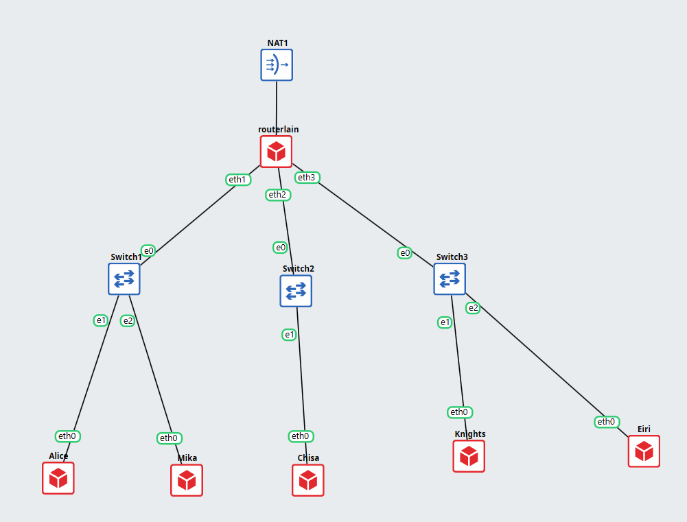

---

#### 2. Karena menurut Lain pada saat itu The Wired masih terisolasi dari dunia luar, konfigurasikan router Lain agar dapat tersambung langsung ke jaringan internet publik melalui NAT/DHCP pada interface eth0.
Konfigurasi router agar tersambung langsung ke jaringan internet publik:
```
# Jalur Internet (menuju NAT1)
auto eth0
iface eth0 inet dhcp
    up sysctl -w net.ipv4.ip_forward=1
    up iptables -t nat -A POSTROUTING -o eth0 -j MASQUERADE
```

```
# Jalur ke Subnet-1 (Alice & Mika)
auto eth1
iface eth1 inet static
    address 10.78.1.1
    netmask 255.255.255.0
```
```
# Jalur ke Subnet-2 (Chisa)
auto eth2
iface eth2 inet static
    address 10.78.2.1
    netmask 255.255.255.0
```
```
# Jalur ke Subnet-3 (Knights & Eiri)
auto eth3
iface eth3 inet static
    address 10.78.3.1
    netmask 255.255.255.0
```
---

#### 3. Setelah router Lain terhubung ke internet, pastikan seluruh Entitas (Client) di bawah Switch 1, Switch 2, dan Switch 3 dapat saling terhubung dan berkomunikasi satu sama lain melalui konfigurasi routing.
Dengan configure router:
```
eth1 (Subnet Alice & Mika): 10.78.1.1
eth2 (Subnet Chisa): 10.78.2.1
eth3 (Subnet Knights & Eiri): 10.78.3.1
```
```
IP Alice: 10.78.1.2, Gateway 10.78.1.1
IP Mika:  10.78.1.3, Gateway 10.78.1.1
IP Chisa: 10.78.2.2 Gateway 10.78.2.1
IP Knights: 10.78.3.2 Gateway 10.78.3.1
IP Eiri: 10.78.3.3 Gateway 10.78.3.1
```
Jalankan perintah: ``` ping -c 2 10.78.x.x ``` untuk mengecek apakah client satu sama ain sudah dapat terhubung. 

Berikut melalui client1 (Alice) dengan menjalankan perintah: ``` ping -c 2 10.78.3.2 ``` (Knights) 

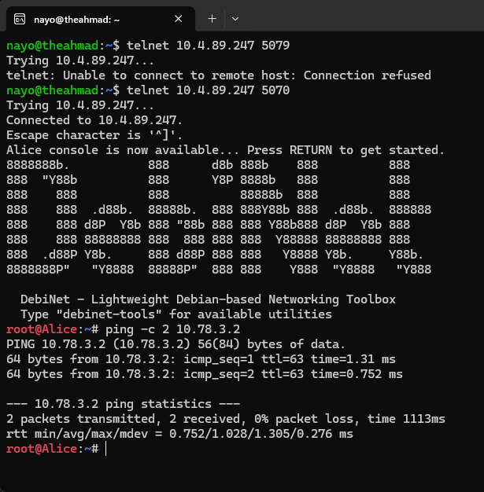


#### 4. Lain ingin agar setiap Entitas (Client) memiliki kemandirian di The Wired. Konfigurasikan firewall/iptables (NAT Masquerade) dan DNS resolver agar setiap Client dapat terhubung ke internet secara mandiri (dapat melakukan ping ke 8.8.8.8 dan membuka domain web google.com).
```
sysctl -w net.ipv4.ip_forward=1
```
```
iptables -t nat -A POSTROUTING -o eth0 -j MASQUERADE
iptables -A FORWARD -i eth1 -o eth0 -j ACCEPT
iptables -A FORWARD -i eth2 -o eth0 -j ACCEPT
iptables -A FORWARD -i eth0 -m state --state ESTABLISHED,RELATED -j ACCEPT
```

---


#### 5. Eiri tetap berupaya menanamkan kekacauan ke dalam jaringan. Untuk mengantisipasi restart tiba-tiba, pastikan seluruh konfigurasi jaringan tidak hilang saat semua node di-restart. Buat script verifikasi di /root/cek_status.sh pada router Lain yang menampilkan ringkasan interface (ip -br a) dan status tabel NAT (iptables -t nat -L -v -n) setelah reboot.
Membuat shell script cek_status.sh dengan shell code:
```
echo "=================================================="
echo "1. STATUS INTERFACE & IP ADDRESS (ip -br a)"
echo "=================================================="
ip -br a

echo ""
echo "=================================================="
echo "2. STATUS RULE IPTABLES NAT (iptables -t nat -L -v -n)"
echo "=================================================="
iptables -t nat -L -v -n
echo "=================================================="
```

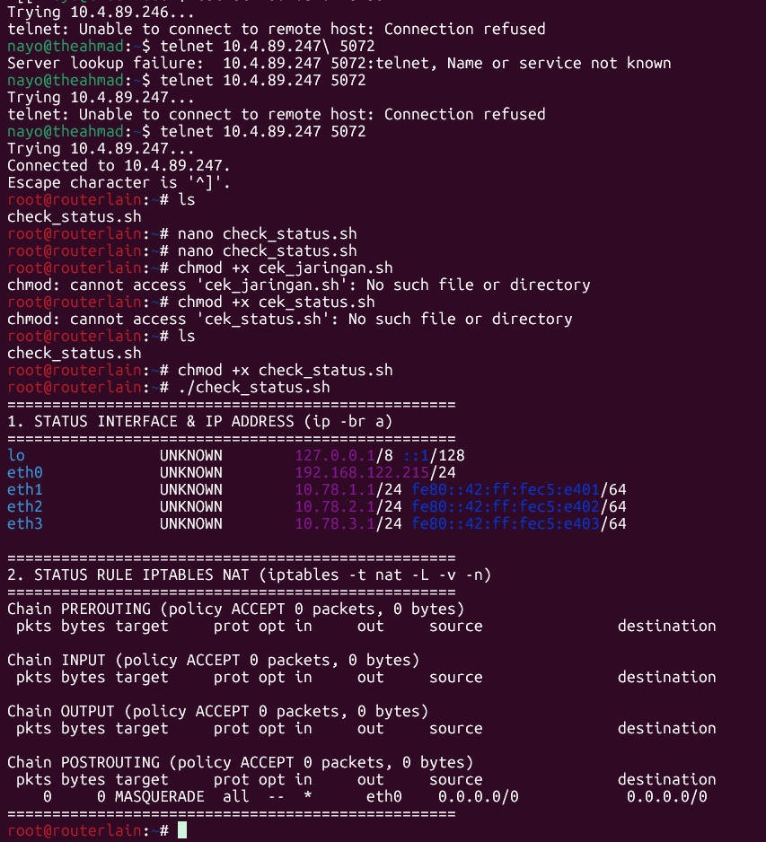

Seluruh konfigurasi interface (eth0, eth1, eth2, eth3) dan NAT Masquerade pada eth0 berhasil tersimpan secara permanen di router Lain dan otomatis dimuat ulang saat reboot.

Script /root/cek_status.sh berhasil mengeksekusi pemeriksaan jaringan dengan menampilkan ringkasan IP address per interface serta rule tabel NAT iptables secara lengkap dan valid.

---

#### 6. Mika mencurigai adanya anomali traffic pada segmen jaringannya. Jalankan generator traffic berikut (link file) pada node Mika, lalu lakukan packet sniffing menggunakan Wireshark pada interface node Mika. Terapkan display filter khusus untuk menyaring paket yang berprotokol DNS atau ICMP. Tunjukkan screenshot hasil filter beserta ringkasan paket yang lolos.
Dokumentasi hasil filter besertakan ringkasan paket yang lolos:
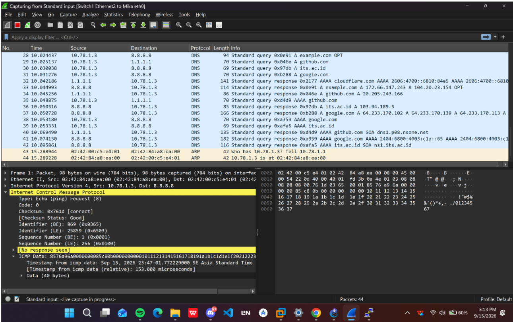
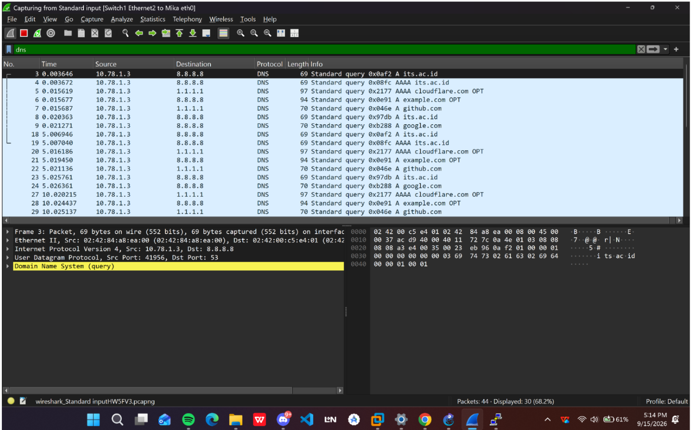
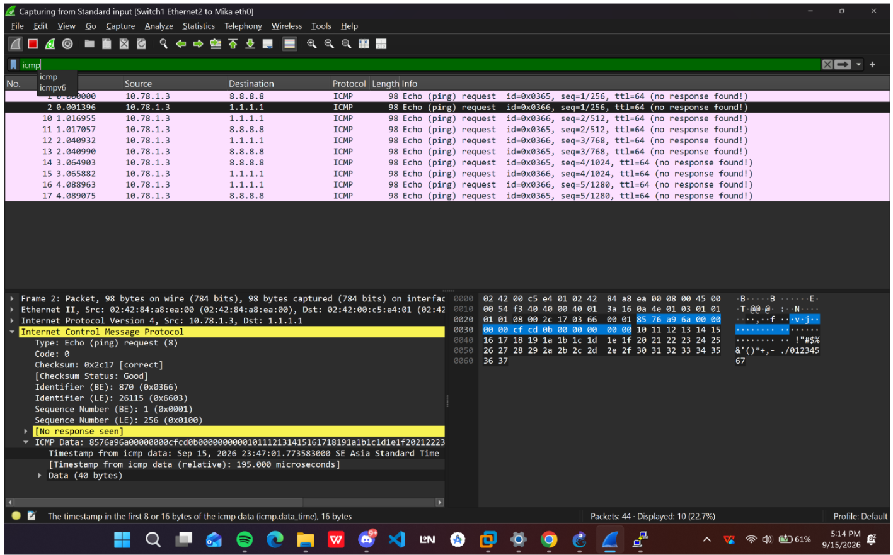

---

#### 7. Chisa memutuskan mendirikan FTP Server pada node miliknya dengan shared folder di /var/wired/data. Terapkan kebijakan akses: user alice (hak akses read & write), user mika (dibatasi read-only), dan user eiri (dibatasi tanpa izin akses / blacklist). Buktikan konfigurasi dengan membuat file signal_alice.txt dari user alice, dan buktikan penolakan akses saat user eiri mencoba login.

```
apt update && apt install -y vsftpd nano 
nano /etc/vsftpd.conf 
sftpd start atau /usr/sbin/vsftpd & 
```
```
mkdir -p /var/wired/data
chmod 777 /var/wired/data

useradd -m -s /bin/bash alice
useradd -m -s /bin/bash mika
useradd -m -s /bin/bash eiri

echo "alice:123" | chpasswd
echo "mika:123" | chpasswd
echo "eiri:123" | chpasswd

cat /etc/passwd | grep -E "alice|mika|eiri" 

nano /etc/vsftpd.conf
```
Pastikan baris-baris berikut tidak memiliki tanda pagar (#) dan nilainya sesuai (tambahkan di baris paling bawah jika tidak ada):
``` 
listen=YES
listen_ipv6=NO
anonymous_enable=NO
local_enable=YES
write_enable=YES
local_root=/var/wired/data

# Konfigurasi Blacklist & Hak Akses Spesifik
userlist_enable=YES
userlist_deny=YES
userlist_file=/etc/vsftpd.userlist
user_config_dir=/etc/vsftpd_user_conf

echo "eiri" > /etc/vsftpd.userlist

cat /etc/vsftpd.userlist 

mkdir -p /etc/vsftpd_user_conf
echo "write_enable=NO" > /etc/vsftpd_user_conf/mika

cat /etc/vsftpd_user_conf/mika 
```
```
apt -o Acquire::ForceIPv4=true install -y ftp
killall vsftpd
/usr/sbin/vsftpd &
```
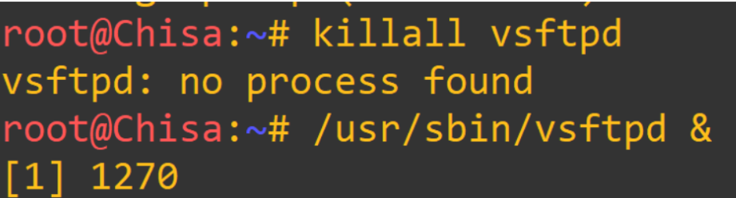


1. User eiri (dibatasi tanpa izin akses / blacklist) buktikan penolakan akses saat user eiri mencoba login.
   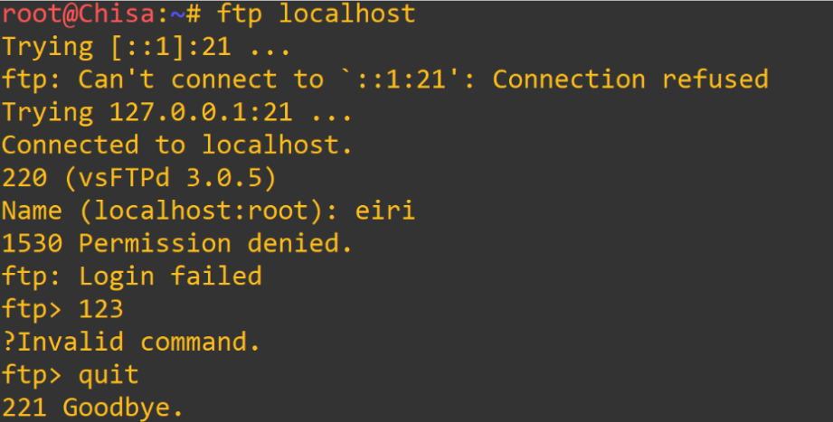
2. User alice (hak akses read & write) Buktikan konfigurasi dengan membuat file signal_alice.txt dari user alice.
   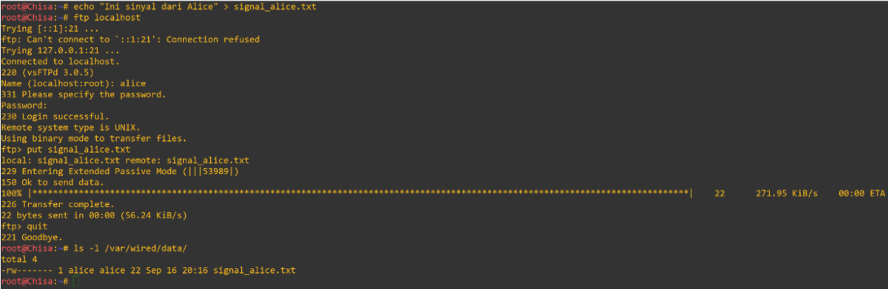
3. Pembuktian mika read only
   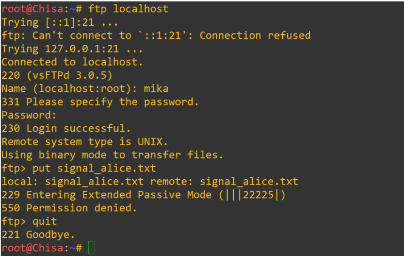


#### 8. Kelompok rahasia Knights perlu mengirimkan dokumen laporan intelijen ke FTP Server Chisa. Lakukan koneksi FTP client dari node Knights ke FTP Server Chisa menggunakan akun alice. Upload file berikut (link file). Analisis sesi Wireshark dan sebutkan: perintah FTP untuk upload (STOR), kode status sukses server (226), dan port data TCP yang dinegosiasikan pada mode PASV.

Pada node Knights
```
Touch knights_report.txt

==================================================
  KNIGHTS OF THE EASTERN CALCULUS — STATUS REPORT
  Protocol 7 Surveillance Network
  Classification: LEVEL 7 — EYES ONLY
==================================================

Date: [CLASSIFIED]
Agent: Knights Unit Alpha
Node: Switch 3 — Subnet 10.<PREFIX>.3.0/24

---

SUBJECT: Network Reconnaissance Report

The Wired has been successfully infiltrated through
Protocol 7 channels. Current observations:

1. Router "Lain" has been identified as the central
   gateway node connecting all three subnet segments.

2. Switch 1 (10.<PREFIX>.1.0/24) hosts Alice and Mika.
   Both nodes show standard traffic patterns.

3. Switch 2 (10.<PREFIX>.2.0/24) hosts Chisa alone.
   Isolated subnet — minimal cross-traffic observed.

4. Switch 3 (10.<PREFIX>.3.0/24) — our operational base.
   Knights and Eiri coexist on this segment.

RECOMMENDATION:
Continue monitoring FTP and Telnet sessions for
plaintext credential exposure. SSH tunnels remain
impenetrable without keylog access.

--- END OF REPORT ---
Knights of the Eastern Calculus
"Let's all love Lain."
```

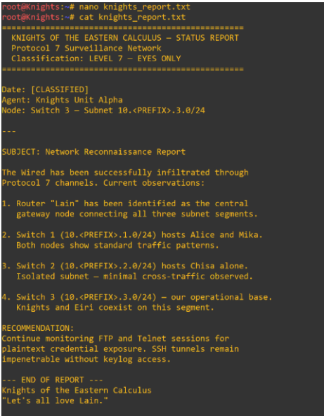

```
ftp 10.78.2.2 
passive 
put knights_report.txt
quit 
```

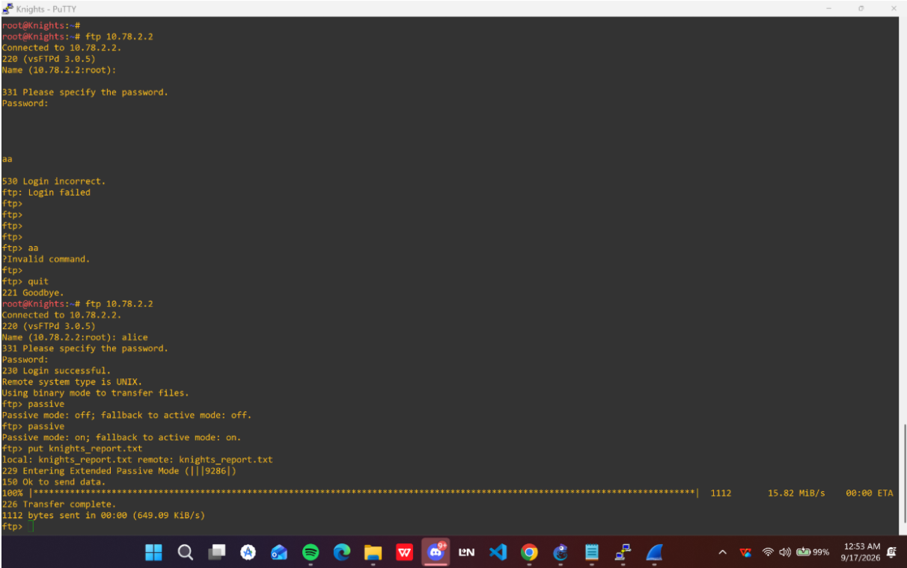
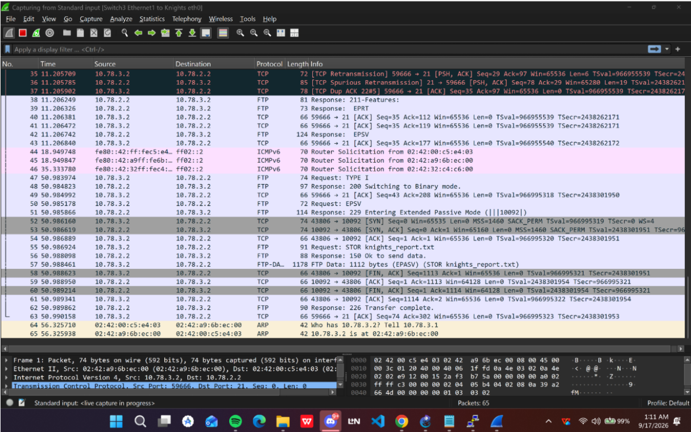

    1. Port Data TCP yang Dinegosiasikan (Mode EPSV)
        Bukti di Wireshark: Paket No. 51.
        Analisis: Karena klien menggunakan Extended Passive Mode (EPSV), peladen merespons dengan kode 229 Entering Extended Passive Mode (|||10092|). Angka di dalam kurung tersebut menunjukkan bahwa port data dinamis yang dinegosiasikan dan dibuka oleh peladen untuk jalur masuk data adalah TCP Port 10092. (Catatan: Port ini terbukti berada di dalam rentang 10000-10100 yang telah kita konfigurasi sebelumnya).

    2. Perintah FTP untuk Upload (STOR)
        Bukti di Wireshark: Paket No. 55.
        Analisis: Setelah jalur data (Port 10092) terbentuk melalui proses TCP Handshake (Paket 52-54), klien Knights mengirimkan perintah STOR knights_report.txt melalui jalur kontrol (Port 21). Perintah ini menginstruksikan peladen Chisa untuk bersiap menerima aliran data yang akan disimpan dengan nama fail tersebut.

    3. Kode Status Sukses Server (226)
        Bukti di Wireshark: Paket No. 62.
        Analisis: Setelah transfer data fail selesai dilakukan (Paket No. 57) dan jalur data 10092 ditutup (klien dan peladen saling mengirim paket FIN/ACK pada Paket 58-61), peladen Chisa mengirimkan konfirmasi final berupa kode 226 Transfer complete melalui jalur kontrol (Port 21). Ini membuktikan bahwa fail intelijen telah utuh diterima dan proses upload selesai dengan sempurna.

---

#### 9. Mika mengakses dokumen Protokol Tujuh di (link file) dari FTP Server Chisa. Dari node Mika, unduh file tersebut menggunakan akun mika. Setelah itu, buktikan pembatasan read-only dengan mencoba mengunggah file baru dari akun mika, dan tunjukkan pesan error respon server (error 550 Permission denied) saat mika mencoba melakukan upload.
Di node Chisa, buat file manifesto menggunakan perintah berikut:
```bash
cat << 'EOF' > /var/wired/data/protocol7_manifesto.txt
==================================================
PROTOCOL 7 — THE MANIFESTO
A Declaration of Digital Consciousness
Serial Experiments Lain — Year 2026
==================================================
ARTICLE I: THE NATURE OF THE WIRED
-----------------------------------
The Wired is not merely a network of interconnected machines.
It is the collective unconscious of humanity, rendered in packets and protocols.
Every TCP handshake is a conversation. Every DNS query is a question.
Every encrypted tunnel is a whispered secret.

ARTICLE II: THE SEVEN PRINCIPLES
----------------------------------
1. All nodes are equal in the eyes of the router.
2. No packet shall be dropped without cause.
3. Encryption is the right of every connection.
4. Plaintext protocols expose the vulnerable.
5. The firewall protects, but also imprisons.
6. NAT masquerade hides truth behind a single face.
7. The Wired remembers everything — packet loss is merely a temporary forgetting.

ARTICLE III: THE PROPHECY OF LAIN
-----------------------------------
"If you're not remembered, then you never existed."
In the world of networking, persistence is survival.
A configuration that vanishes upon restart is a thought that was never truly committed to memory.
Therefore: Save your iptables. Write your interfaces. Let your routing tables endure beyond the power cycle.

ARTICLE IV: CONCERNING SECURITY
---------------------------------
Telnet is the glass house of protocols — transparent to any observer with a packet sniffer.
SSH is the steel vault — its contents visible only to those who possess the key.
Choose wisely which door you open to The Wired.
---
"No matter where you go, everyone's connected." — Lain Iwakura
EOF

cat /var/wired/data/protocol7_manifesto.txt
```
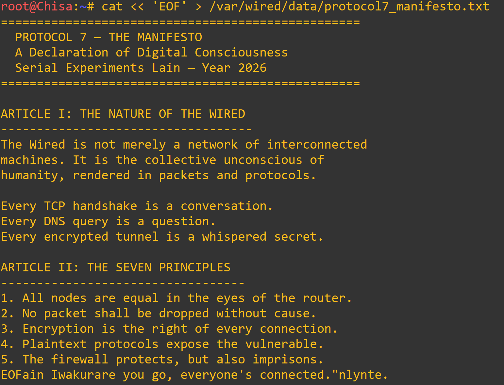
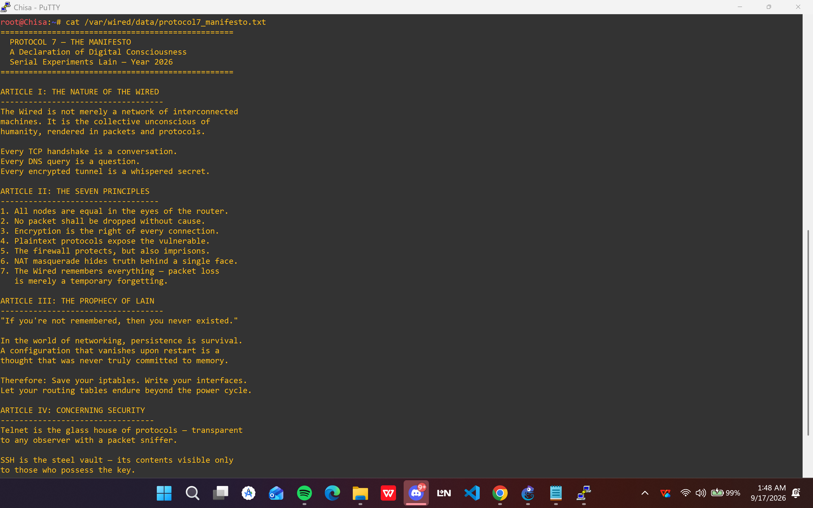

Lakukan pengujian *read-only* dari node Mika:
```bash
echo "Ini file dummy untuk tes error 550" > tes_mika.txt
ftp 10.78.2.2
passive
get protocol7_manifesto.txt
put tes_mika.txt
```
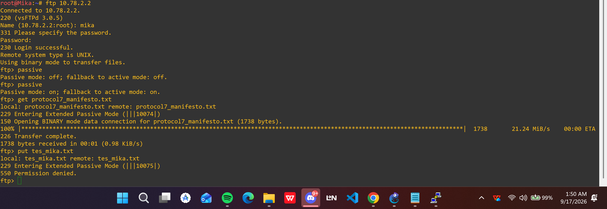

---

#### 10. Knights melancarkan uji ketahanan koneksi ke server Chisa untuk menguji latensi jaringan The Wired. Kirimkan paket ping dari node Knights ke node Chisa dengan payload khusus 128 bytes dan interval 0.3 detik sebanyak 77 paket (ping -c 77 -s 128 -i 0.3 <IP_Chisa>). Buka Wireshark, catat nilai ICMP Type dan Code untuk Echo Request vs Echo Reply, serta analisis packet loss dan RTT (min/avg/max).
Di terminal node Knights:
```bash
ping -c 77 -s 128 -i 0.3 10.78.2.2
```
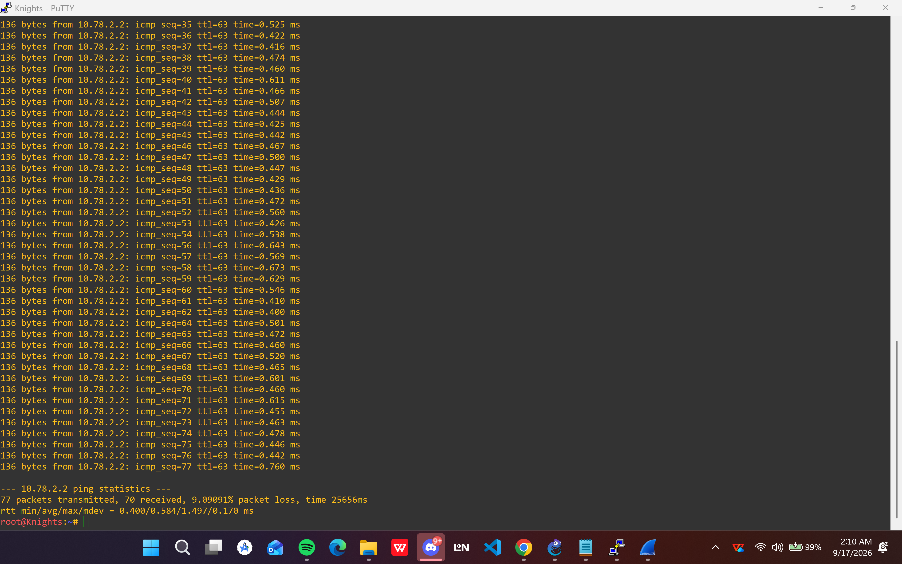
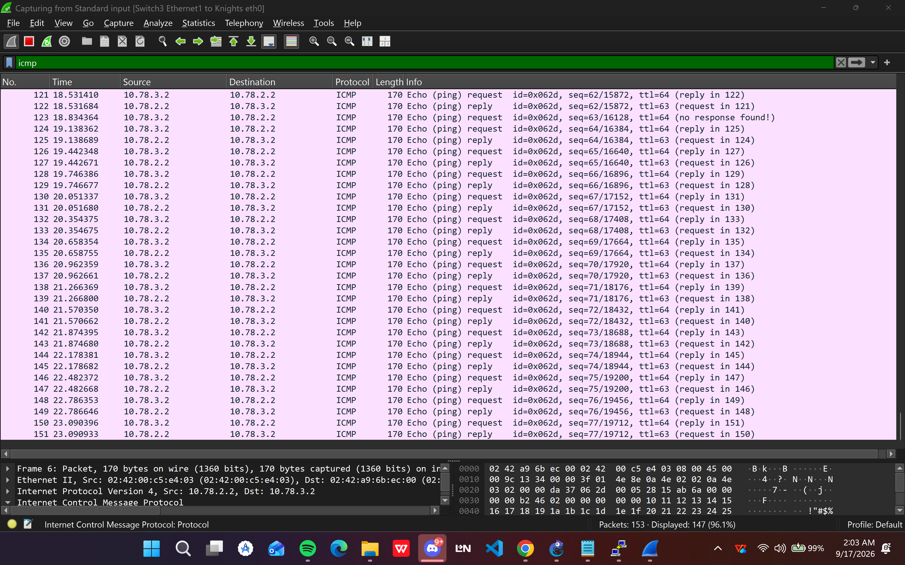
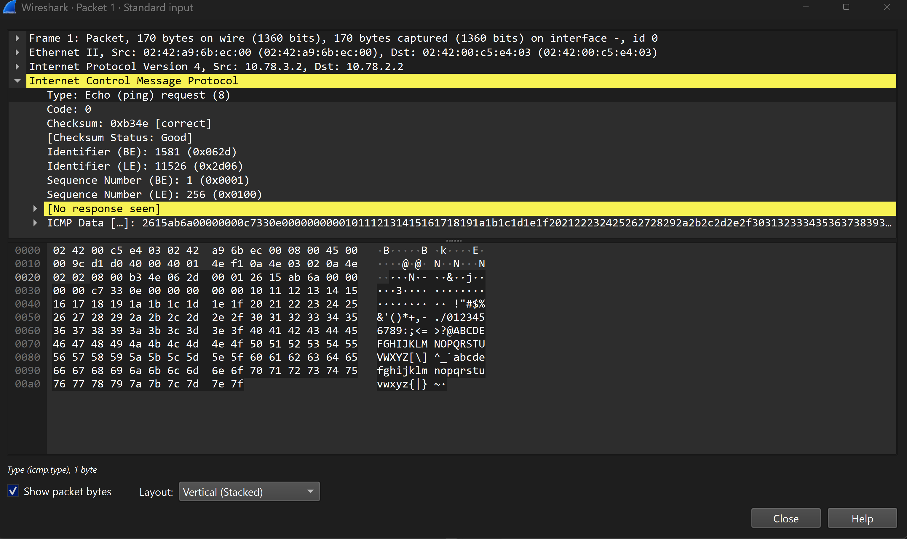
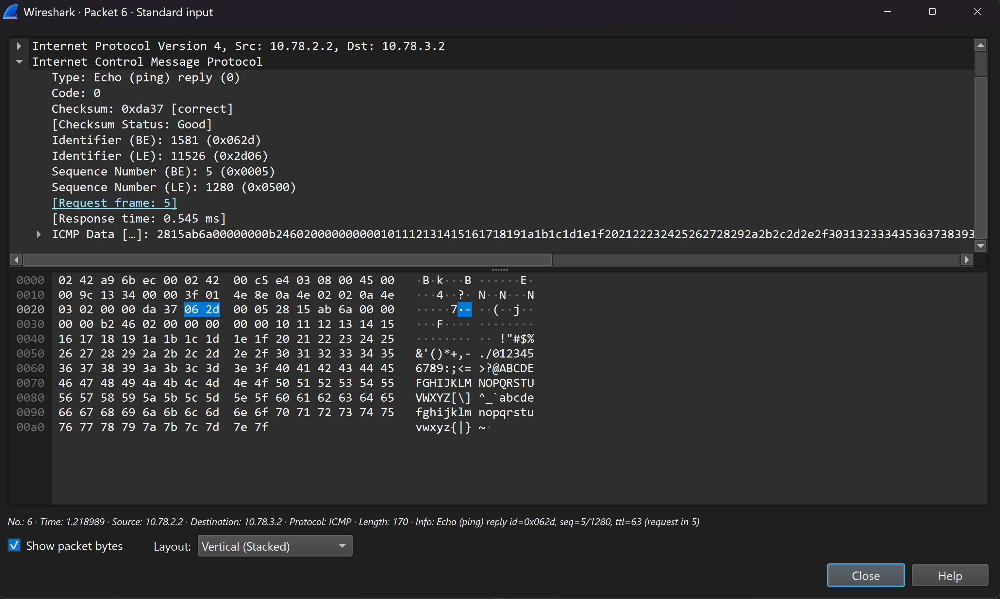

**1. Analisis Nilai ICMP (Type dan Code)**
Berdasarkan tangkapan lalu lintas paket menggunakan Wireshark, protokol ICMP bekerja dengan format balasan sebagai berikut:
- **Echo Request:** Paket permintaan yang dikirimkan oleh Knights menuju Chisa menggunakan nilai **Type 8** dan **Code 0**.
- **Echo Reply:** Paket balasan yang dikembalikan oleh server Chisa menuju Knights menggunakan nilai **Type 0** dan **Code 0**.

**2. Analisis Packet Loss**
Berdasarkan hasil pengujian, terbukti terjadi **packet loss** pada lalu lintas "The Wired".
- **Bukti Wireshark:** Pada tangkapan layar Wireshark (Paket No. 123), terlihat bahwa Knights mengirimkan permintaan ke-63 (*seq=63/16128*), namun paket tersebut mendapatkan keterangan **(no response found!)**.
- **Pembahasan:** Hal ini membuktikan bahwa paket tersebut ter-*drop* atau hilang di tengah jalan (kemungkinan besar pada antrean *router* NAT). Pengiriman paket yang masif dan cepat (interval 0,3 detik) menyebabkan *bottleneck* atau kelebihan beban sesaat, sehingga ada paket yang gagal diproses atau gagal dikembalikan.

**3. Analisis RTT (Round-Trip Time)**
Berdasarkan statistik akhir pada terminal Knights, latensi jaringan dari 77 paket tersebut menunjukkan nilai RTT sebagai berikut:
- **Minimum (min):** *0.400 ms* (Waktu tercepat paket membalas).
- **Average (avg):** *0.584 ms* (Rata-rata latensi koneksi selama pengujian).
- **Maximum (max):** *1.497 ms* (Waktu paling lambat, biasanya terjadi pada awal koneksi saat proses pencarian rute atau saat terjadi antrean padat).

---

#### 11. Buktikan kelemahan protokol Telnet dengan membuat akun phantom_user dan password wired_ghost pada layanan telnetd di node Chisa. Lakukan login Telnet dari node Eiri ke node Chisa dan tangkap sesi menggunakan Wireshark. Tunjukkan kredensial plain text melalui fitur Follow TCP Stream, serta jelaskan mengapa setiap karakter terkirim dalam paket TCP terpisah.
Di node Chisa:
```bash
# 1. Instal aplikasi telnet server dan inetd
apt -o Acquire::ForceIPv4=true install -y telnetd openbsd-inetd

# 2. Daftarkan telnet ke dalam manajer layanan inetd
echo "telnet stream tcp nowait root /usr/sbin/telnetd" > /etc/inetd.conf

# 3. Buat user dan password rahasia
useradd -m -s /bin/bash phantom_user
echo "phantom_user:wired_ghost" | chpasswd

# 4. Nyalakan layanan
/etc/init.d/openbsd-inetd restart
```

Di node Eiri:
```bash
# 1. Update dan instal klien telnet
apt -o Acquire::ForceIPv4=true update 
apt -o Acquire::ForceIPv4=true install -y telnet

# 2. Lakukan koneksi ke Chisa
telnet 10.78.2.2
```
Masuk dengan akun `phantom_user` dan sandi `wired_ghost`.

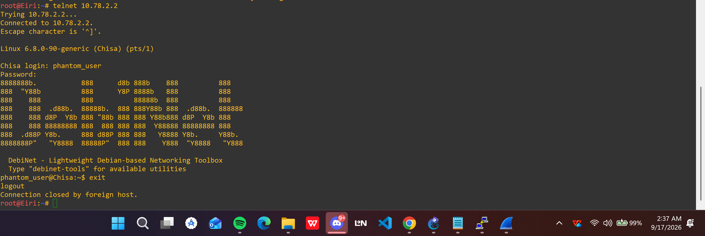
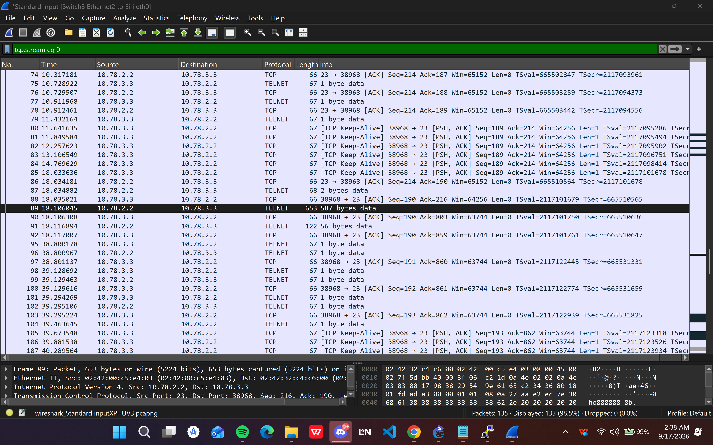
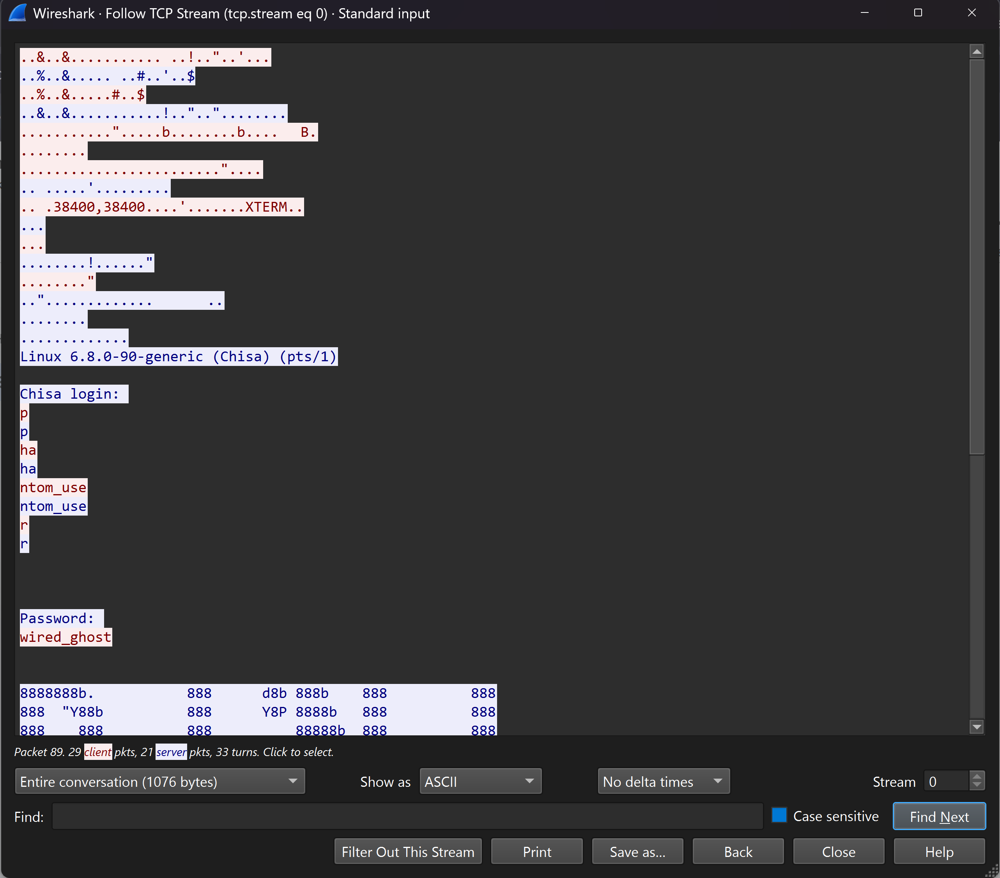

**1. Bukti Eksekusi Login Telnet**
Berdasarkan tangkapan layar terminal *node* Eiri, koneksi Telnet menuju peladen Chisa (`10.78.2.2`) telah berhasil dilakukan. Klien sukses melakukan *login* menggunakan *username* `phantom_user` dan *password* `wired_ghost`, yang ditandai dengan munculnya *banner* sistem "DebiNet - Lightweight Debian-based Networking Toolbox".

**2. Bukti Kredensial *Plain Text* (Analisis Follow TCP Stream)**
Melalui pengamatan lalu lintas jaringan menggunakan fitur **Follow TCP Stream** di Wireshark, terbukti bahwa Telnet adalah protokol yang sangat rentan (sesuai dengan Manifesto "The Wired" yang menyebutnya sebagai *glass house*).
- **Analisis Bukti:** Pada jendela *Follow TCP Stream*, seluruh komunikasi dapat dibaca dengan jelas dalam bentuk *plain text* (teks biasa) tanpa adanya enkripsi sama sekali.
- **Keterangan Warna:** Teks berwarna **merah** adalah data yang dikirimkan oleh klien (Eiri), sedangkan teks berwarna **biru** adalah respons/*echo* yang dikembalikan oleh peladen (Chisa). Oleh karena itu, siapa pun yang menyadap jaringan ini dapat dengan mudah melihat kata sandi `wired_ghost` yang diketikkan oleh pengguna.

**3. Analisis Pengiriman Paket Karakter Terpisah**
Pada tangkapan layar daftar paket Wireshark (kolom *Info*), terlihat banyak sekali paket berprotokol TELNET yang hanya membawa **1 byte data**. Selain itu, pada *Follow TCP Stream*, input klien terlihat ganda/diulang (seperti `p p h h a a n n`).
- **Alasan (Pembahasan):** Hal ini terjadi karena Telnet beroperasi menggunakan **Mode Karakter (*Character-at-a-time mode*)**. Dalam mode ini, protokol tidak menunggu pengguna selesai mengetik satu kata utuh atau menekan *Enter*.
- Setiap kali pengguna menekan **satu tombol huruf** di *keyboard* (misal: tombol 'p'), huruf tersebut (1 *byte*) akan langsung dikemas ke dalam satu paket TCP terpisah dan dikirimkan ke peladen. Peladen kemudian akan merespons dengan mengirimkan kembali huruf 'p' tersebut (paket *echo*) agar bisa divisualisasikan/muncul di layar terminal klien. Mekanisme inilah yang membuat setiap karakter terkirim terpisah dan menghasilkan huruf ganda pada *stream* Wireshark.

---

#### 12. Alice mencurigai Knights menjalankan beberapa layanan rahasia di node-nya. Lakukan pemindaian port dari node Alice ke node Knights menggunakan Netcat (nc) untuk memeriksa port 22 (SSH) dan 80 (HTTP) dalam keadaan terbuka, serta port rahasia 7777 dalam keadaan tertutup. Analisis di Wireshark perbedaan TCP Flag yang dikembalikan antara port terbuka (SYN-ACK) dengan port tertutup (RST-ACK).
Di node Knights:
```bash
echo "nameserver 8.8.8.8" > /etc/resolv.conf
apt -o Acquire::ForceIPv4=true update
apt -o Acquire::ForceIPv4=true install -y openssh-server apache2
/etc/init.d/ssh start
/etc/init.d/apache2 start
ss -tuln | grep -E "22|80"
```

Di node Alice:
```bash
echo "nameserver 8.8.8.8" > /etc/resolv.conf
apt -o Acquire::ForceIPv4=true update && apt -o Acquire::ForceIPv4=true install -y netcat-openbsd
nc -zv 10.78.3.2 22 80 7777
```
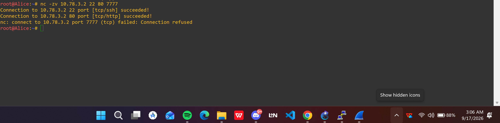

Filter Wireshark:
```text
tcp.port in {22, 80, 7777}
```
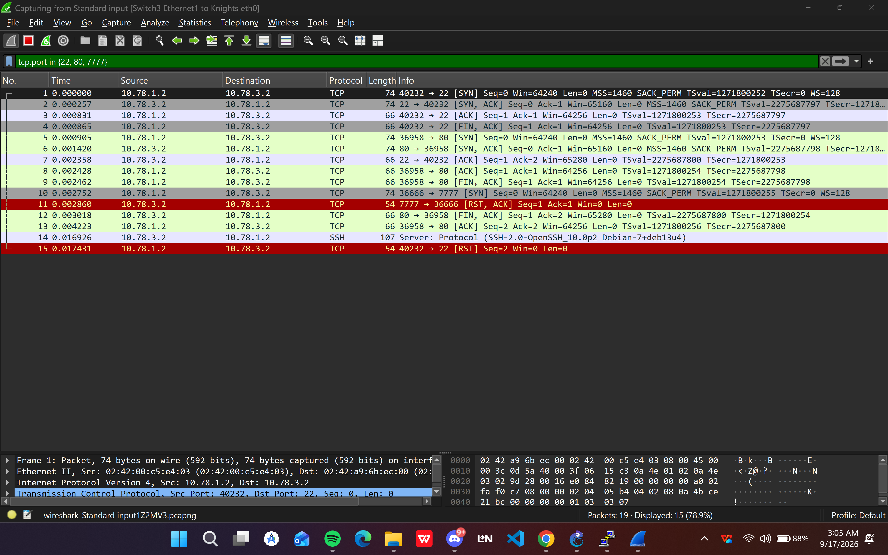

**1. Analisis Port Terbuka (Port 22 dan 80)**
Berdasarkan tangkapan lalu lintas jaringan menggunakan Wireshark, protokol TCP memberikan respons yang berbeda tergantung pada status *port* tujuan:
- **Bukti:** Saat Alice mengirimkan paket inisiasi koneksi `[SYN]`, *node* Knights membalasnya dengan paket yang memiliki bendera **`[SYN, ACK]`** (terlihat pada Paket No. 2 untuk SSH dan Paket No. 6 untuk HTTP).
- **Pembahasan:** Paket `[SYN, ACK]` (*Synchronize-Acknowledge*) adalah bentuk persetujuan dalam mekanisme *TCP Three-Way Handshake*. Bendera ini membuktikan bahwa *port* tujuan dalam keadaan terbuka (aktif) dan layanan di baliknya siap menerima koneksi dari klien.

**2. Analisis Port Tertutup (Port 7777)**
- **Bukti:** Saat Alice mencoba mengirimkan paket `[SYN]` ke *port* 7777, *node* Knights seketika mengembalikan paket balasan dengan bendera **`[RST, ACK]`** (terlihat pada Paket No. 11 berwarna merah).
- **Pembahasan:** Paket `[RST, ACK]` (*Reset-Acknowledge*) merupakan mekanisme penolakan aktif dari sistem operasi. Karena tidak ada layanan atau aplikasi yang sedang berjalan/mendengarkan di *port* 7777, sistem Knights secara otomatis menolak dan memutus koneksi tersebut secara paksa, yang kemudian diterjemahkan oleh Netcat sebagai *Connection refused*.

---

#### 13. Lain memerintahkan agar administrasi jarak jauh menggunakan SSH secara aman tanpa password. Install OpenSSH server pada node Knights, buat pasangan kunci SSH (ssh-keygen) pada node Mika untuk user mika_admin, dan konfigurasikan public key authentication (PasswordAuthentication no). Lakukan koneksi SSH dari node Mika ke node Knights, tangkap sesi menggunakan Wireshark, identifikasi paket Protocol Version Exchange dan Key Exchange, serta jelaskan mengapa kredensial tidak terlihat dalam bentuk teks terbuka seperti pada Telnet.
Di node Knights:
```bash
useradd -m -s /bin/bash mika_admin 
passwd mika_admin 
```
*(Masukkan Password: rahasia123)*
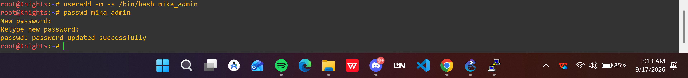

Di node Mika:
```bash
useradd -m -s /bin/bash mika_admin
su - mika_admin
ssh-keygen -t rsa -b 2048
```
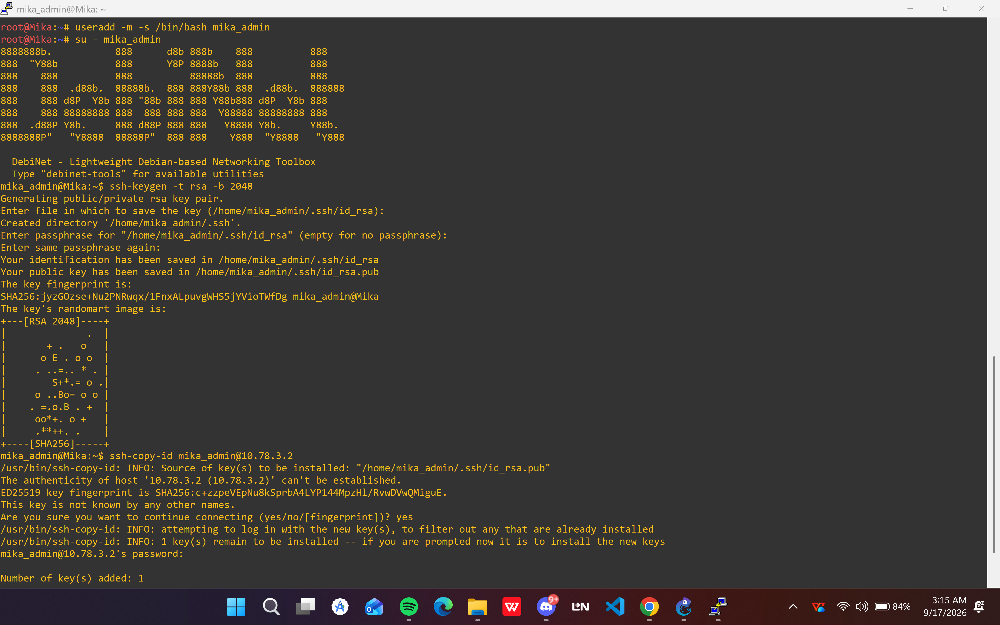

Di node Knights, edit file konfigurasi SSH:
```bash
nano /etc/ssh/sshd_config
```
Cari baris `#PasswordAuthentication yes` (atau tanpa tanda #), ubah menjadi: 
```text
PasswordAuthentication no
```
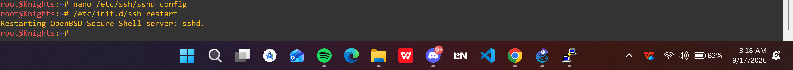

Jalankan perintah berikut di Knights:
```bash
/etc/init.d/ssh restart
```

Kembali ke node Mika, lakukan login:
```bash
ssh mika_admin@10.78.3.2
```
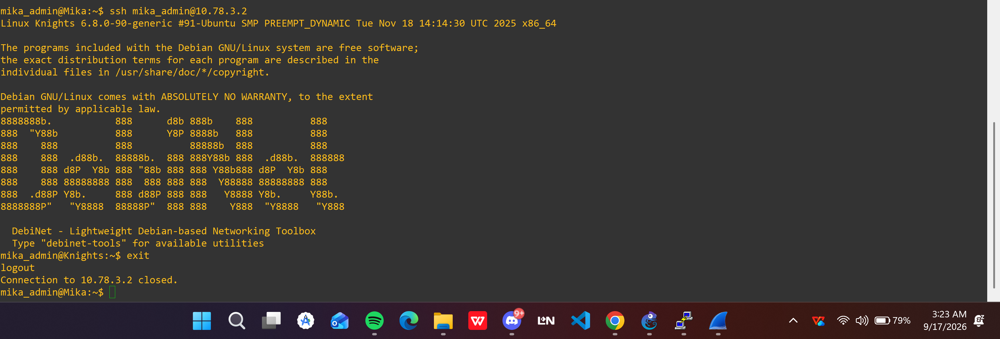
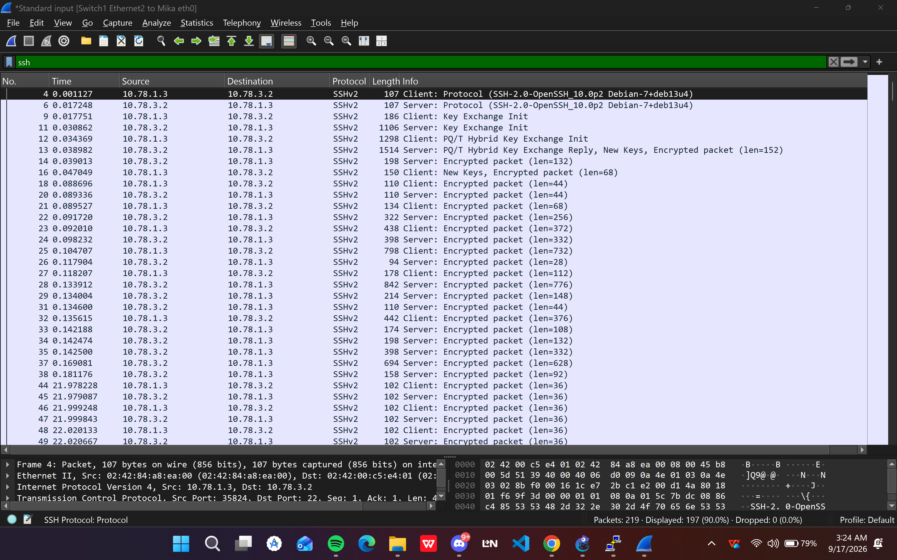

**1. Identifikasi *Protocol Version Exchange***
- **Temuan (Paket No. 4 & No. 6):** Pada awal transaksi, klien dan peladen mengirimkan paket dengan informasi `Protocol (SSH-2.0-OpenSSH_10.0p2...)`.
- **Pembahasan:** Ini adalah fase pertukaran versi protokol (*Protocol Version Exchange*). Pada tahap ini, Mika dan Knights saling bertukar informasi mengenai versi perangkat lunak SSH yang mereka gunakan dalam bentuk *plain text*. Tujuannya adalah untuk memastikan kompabilitas algoritma antara klien dan peladen sebelum sesi enkripsi dimulai.

**2. Identifikasi *Key Exchange***
- **Temuan (Paket No. 9 & No. 11):** Setelah pertukaran versi, muncul paket dengan keterangan `Key Exchange Init`.
- **Pembahasan:** Ini adalah fase negosiasi kunci kriptografi. Pada tahap ini, kedua belah pihak berdiskusi secara aman untuk menyepakati metode enkripsi dan bertukar parameter guna membentuk sebuah *Shared Secret Key* (kunci rahasia bersama) menggunakan algoritma seperti Diffie-Hellman, tanpa harus mengirimkan kunci utamanya melalui jaringan.

**3. Mengapa Kredensial Tidak Terlihat (Perbandingan dengan Telnet)**
Berbeda dengan Telnet yang merupakan protokol *glass house* (seluruh data dikirim dalam bentuk teks terbuka), kredensial pada koneksi SSH ini sama sekali tidak dapat disadap (*sniffing*) karena dua alasan utama:
- **Enkripsi Sesi Penuh:** Setelah fase *Key Exchange* selesai (terlihat mulai dari Paket No. 13 dan seterusnya), seluruh paket komunikasi dikunci menggunakan algoritma enkripsi simetris. Wireshark tidak lagi bisa membaca isi *payload*, dan hanya menampilkannya sebagai `Encrypted packet`.
- **Autentikasi Kunci Publik (Tanpa Kata Sandi):** Karena peladen Knights telah dikonfigurasi dengan `PasswordAuthentication no` dan menggunakan autentikasi `ssh-keygen`, klien (Mika) tidak pernah mengirimkan kata sandi melewati jaringan. Proses masuk divalidasi menggunakan kecocokan matematis antara *Private Key* rahasia milik Mika dengan *Public Key* yang sudah dititipkan di Knights.


#### 14.  Setelah gagal mengakses FTP, Eiri melancarkan serangan brute-force terhadap form login web Alice. Analisis file capture wired_bruteforce.pcapng untuk mengidentifikasi alamat IP penyerang, target IP beserta port yang diserang, password user lain_admin yang berhasil ditembus, serta web server software dan versi yang dilaporkan pada response header. Validasi temuan kalian pada socket server: (link file) nc [IP_Group] 3401 

1. Gambaran umum traffic
    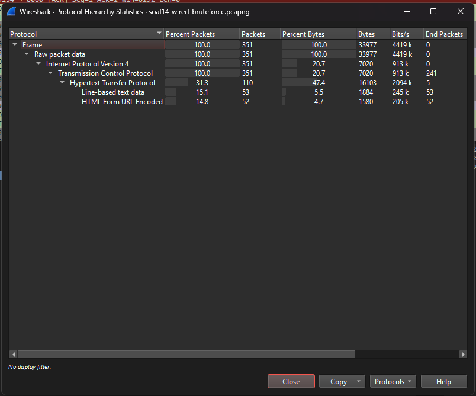
2. Identifikasi IP penyerang
    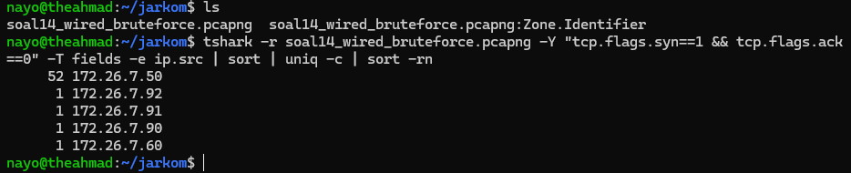   
3. Ip dan Port target
    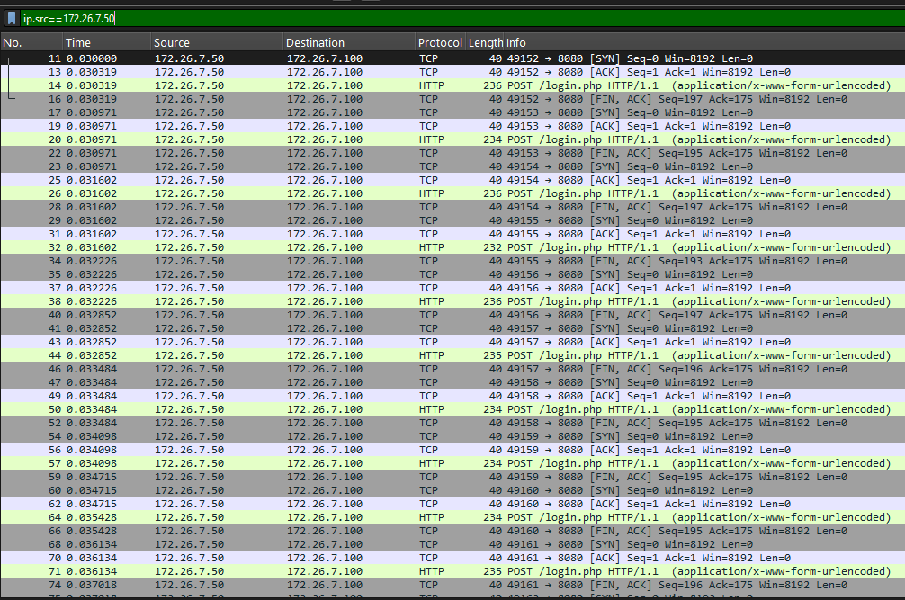
4. Ekstrak isi percobaan login
    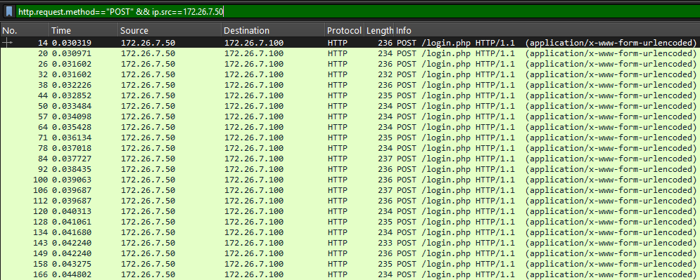
5. Bedakan percobaan gagal vs berhasil
    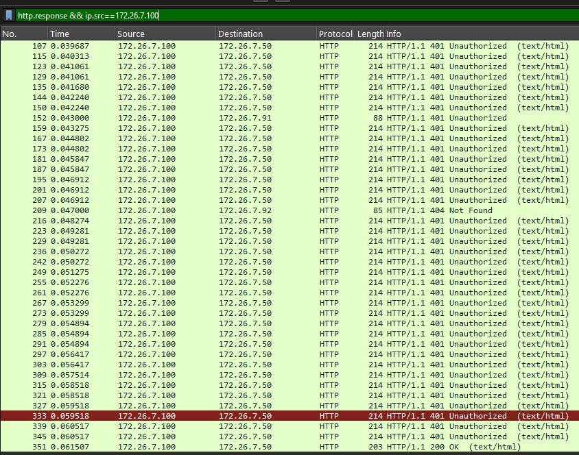
6. Pasangkan response 200 dengan request-nya
    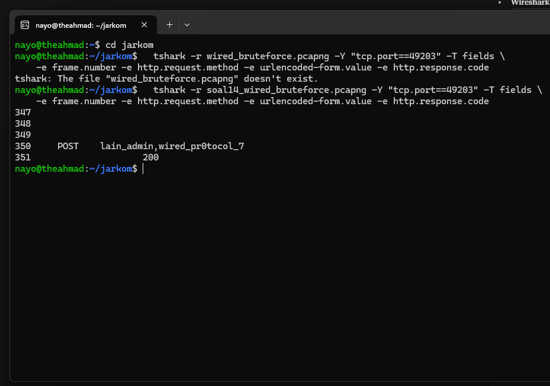
7. Ambil informasi web server dari response header
    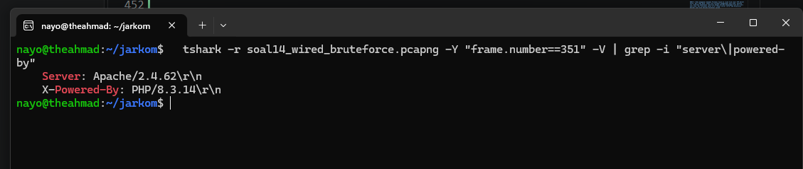

    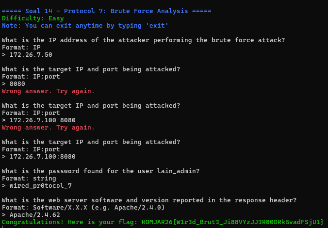
---

#### 15.  Eiri menyusup ke ruang server dan memasang perangkat keyboard USB berbahaya pada node Alice. Buka file capture wired_usb_hid.pcap, identifikasi Vendor ID dan Product ID perangkat USB dari deskriptor USB, alamat nomor device USB, serta pesan rahasia yang berhasil dicuri dari keystroke. Validasi temuan kalian pada socket server: (link file) nc [IP_Group] 3402 

1. Mengecek gambaran umum capture <br>
    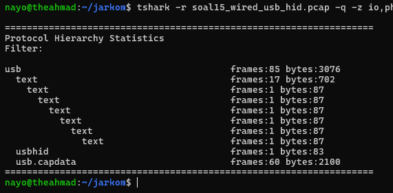
2. Mencari Device Descriptor untuk mengambil id vendor dan id product <br>
    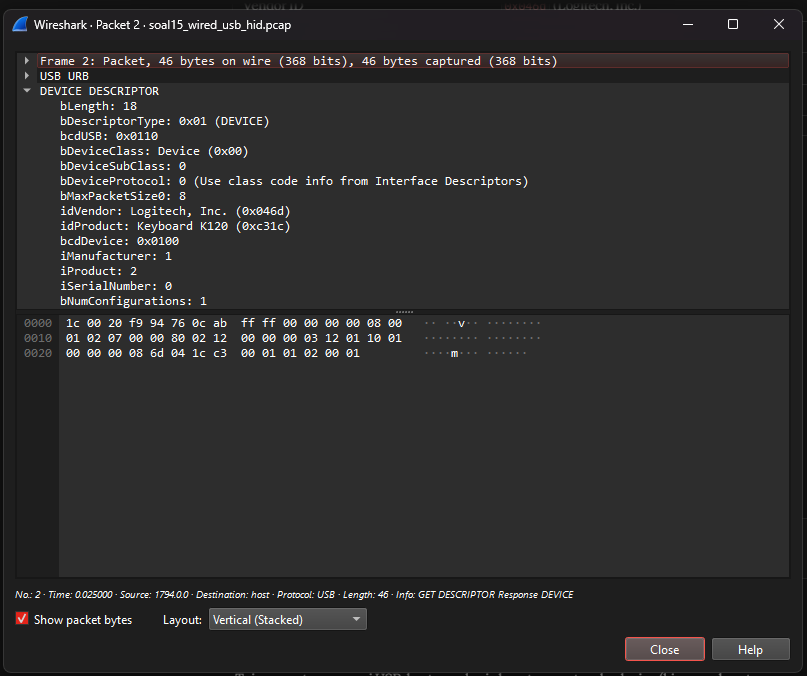
3. Mencari Device Address
    <br>
    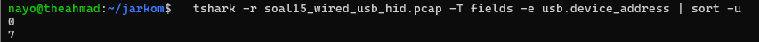 
    0 berartikan dipakai sementara sebelum address di-assign, saat descriptor dibaca dan 7 berartikan address final yang dipakai device ini untuk semua transfer HID.
4. Decode semua keycode menjadi sebuah karakter. <br>
    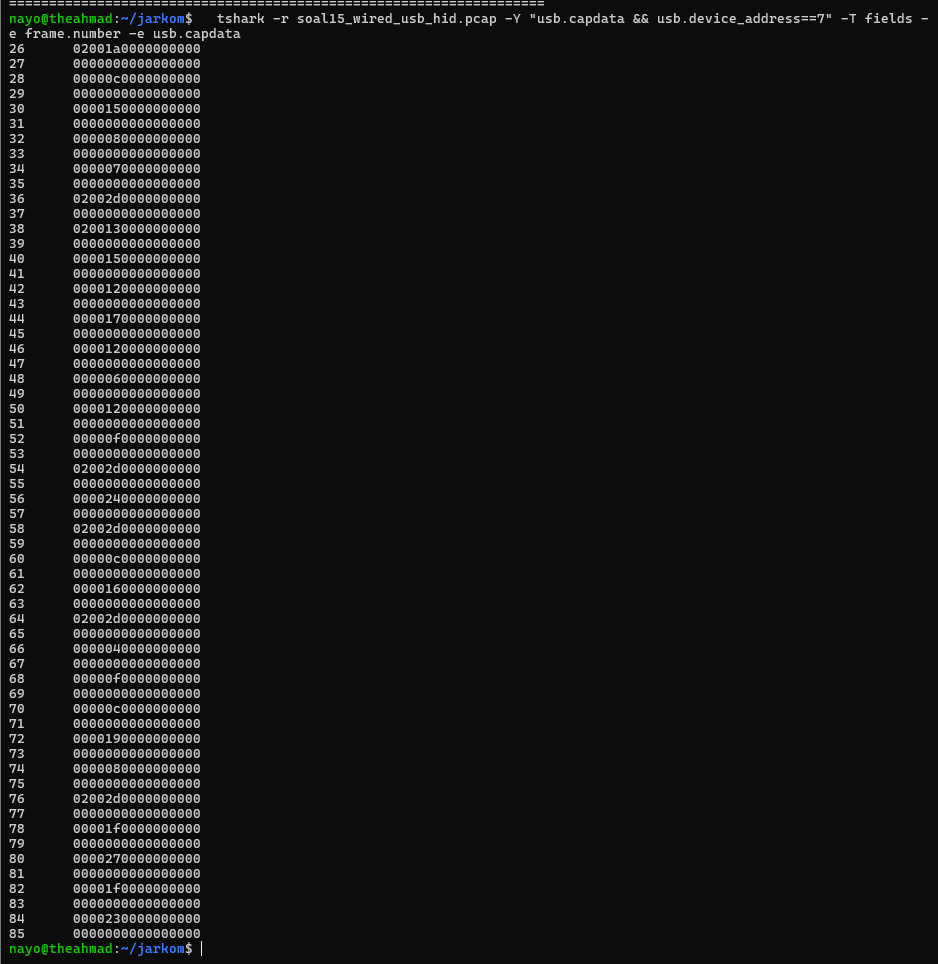 
    Hasilnya adalah: Wired_Protocol_7_is_alive_2026
5. Result. <br>
    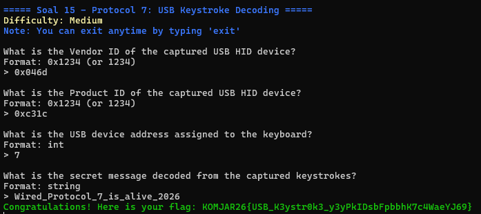

---

#### 16.  Eiri meletakkan file malware di server. Dari file capture wired_ftp_theft.pcap, lakukan analisis lalu lintas FTP untuk mengidentifikasi alamat IP server FTP penyerang, banner software FTP yang digunakan, kredensial login penyerang, serta ukuran (size in bytes) dari file malware knights_payload.exe yang diunduh. Validasi temuan kalian pada socket server: (link file) nc [IP_Group] 3403 

1. Gambaran Umum capture
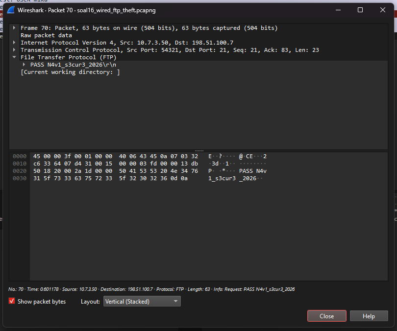

2. Analisis lalu lintas FTP untuk mengidentifikasi alamat IP server FTP penyerang
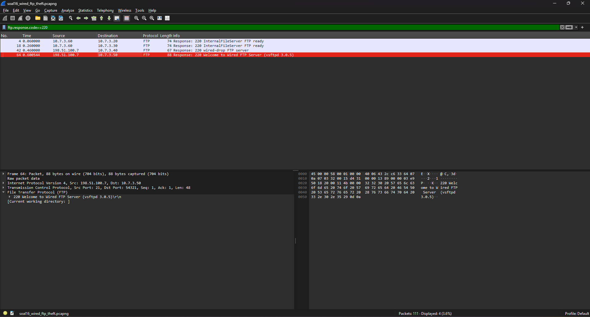

3. Ambil kredensial login
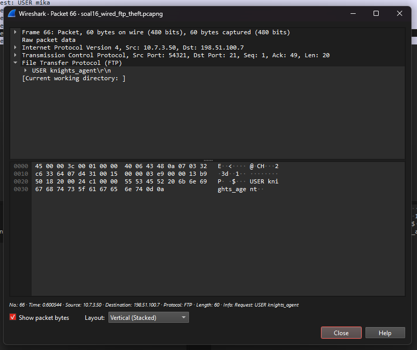
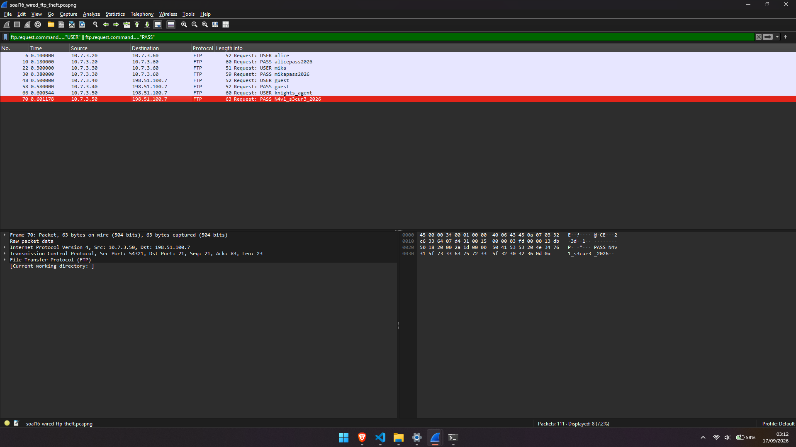

4. Konfirmasi urutan lengkap serangan
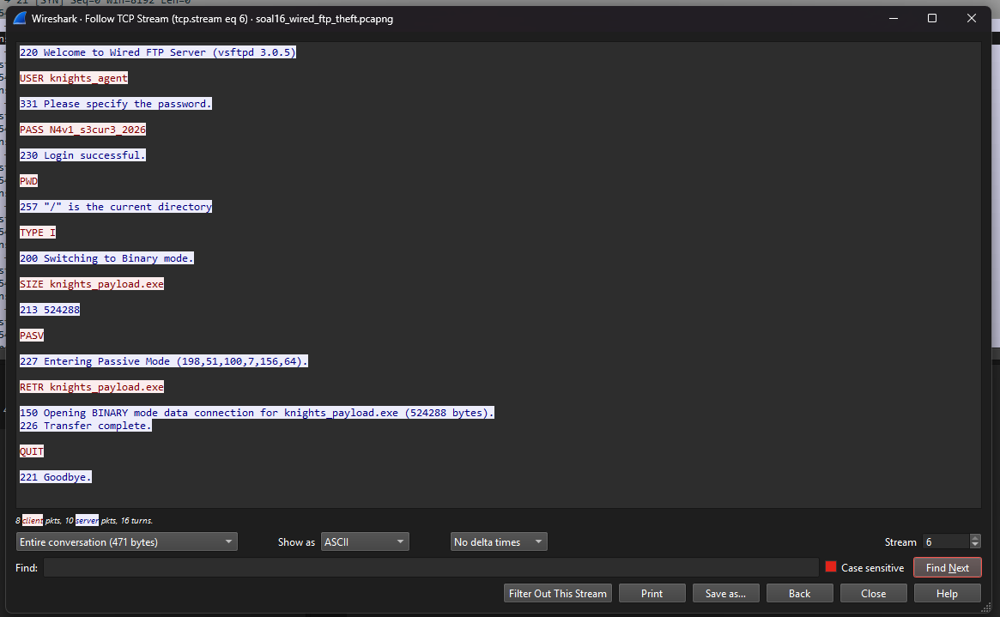
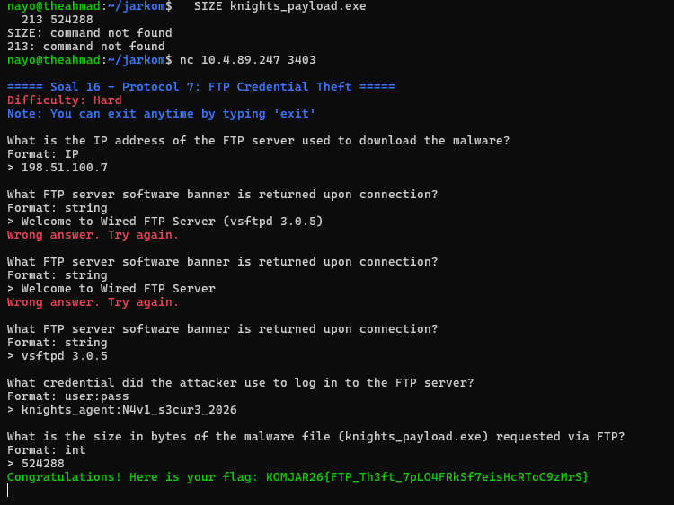

#### 17.  Alice membuat halaman web di node-nya. Eiri memanfaatkan celah untuk mengunduh payload berbahaya ke sistem Alice. Analisis file capture wired_http_c2.pcap untuk mengidentifikasi nama domain (Host) tempat malware diunduh, alamat IP server penyerang, nama file executable malware yang diunduh, serta kode status HTTP yang dikembalikan. Validasi temuan kalian pada socket server: (link file) nc [IP_Group] 3404

1. Gambaran umum
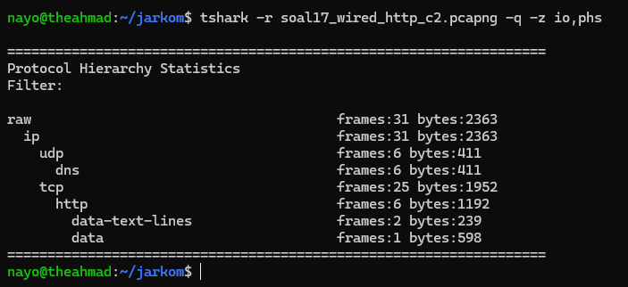

2. Cari semua DNS

3. Cari semua HTTP request

4. Konfirmasi IP tujuan request tersebut

5. Pastikan nama file dan Host

6. Ambil kode status


#### 18.  Eiri mengubah taktik penyerangan dengan menanamkan file malware menggunakan protokol file sharing SMB. Analisis file capture wired_smb_transfer.pcapng untuk mengidentifikasi nama protokol jaringan yang dieksploitasi, IP pengirim dan penerima, folder tujuan penyimpanan malware pada sistem korban, serta nama file executable malware yang ditransfer. Validasi temuan kalian pada socket server:(link file) nc [IP_Group] 3405

1. Gambaran umum

2. Identifikasi IP

3. Urutan SMB2 untuk memahami alur serangan

4. Cari path file lengkap


#### 19. Eiri meneror jaringan dengan mengirimkan email pemerasan melalui protokol SMTP tanpa enkripsi. Analisis file capture wired_smtp_threat.pcap pada stream TCP terkait, identifikasi alamat email korban yang ditargetkan, password korban yang diklaim bocor oleh penyerang, jenis malware yang diinfeksikan, batas waktu (dalam hari) yang diberikan, serta MailClientID yang tercantum pada pesan. Validasi temuan kalian pada socket server:(link file) nc [IP_Group] 3406

1. Gambaran umum file capture

2. Cek banyak sesi email

3. Melihat siapa kirim ke siapa (filter command smtp)

4. Follow TCP Stream

5. Baca isi email 


#### 20. Untuk rencana pamungkasnya, Eiri menyembunyikan komunikasi malware di balik saluran terenkripsi TLS. Namun Alice telah menyediakan file keylog untuk mendekripsi lalu lintas data tersebut. Analisis file capture wired_tls_decrypt.pcapng bersama keyslogfile.txt untuk mengidentifikasi versi protokol TLS yang dinegosiasikan, nama domain (SNI) yang diakses, alamat IP server HTTPS penyerang, User-Agent yang digunakan, serta HTTP request method dan path yang tersembunyi di dalam sesi dekripsi. Validasi temuan kalian pada socket server: (link file) nc [IP_Group] 3407

1. Load file keylog
2. Cek keberhasilan deskripsi filekeylog
3. Ambil versi TLS dari ClientHello & ServerHello
4. Ambil domain yang diakses
5. Ambil IP Server
6. Ambil isi HTTP request yang tersembunyi(setelah deskripsi file keylog)


